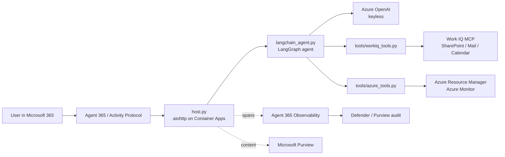
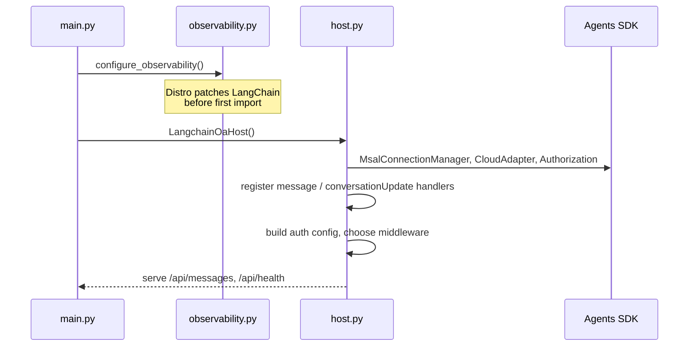
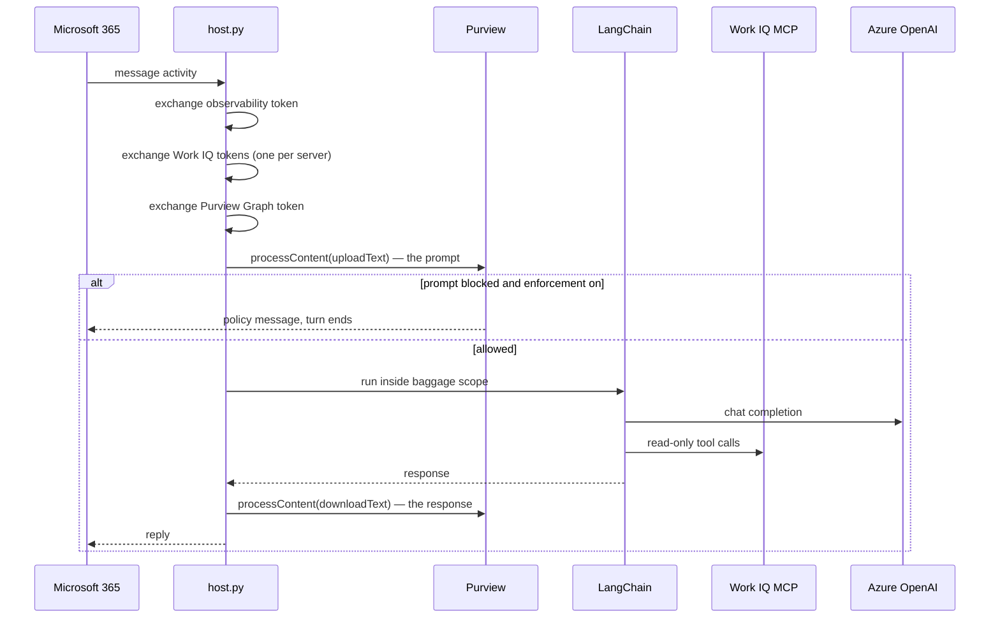
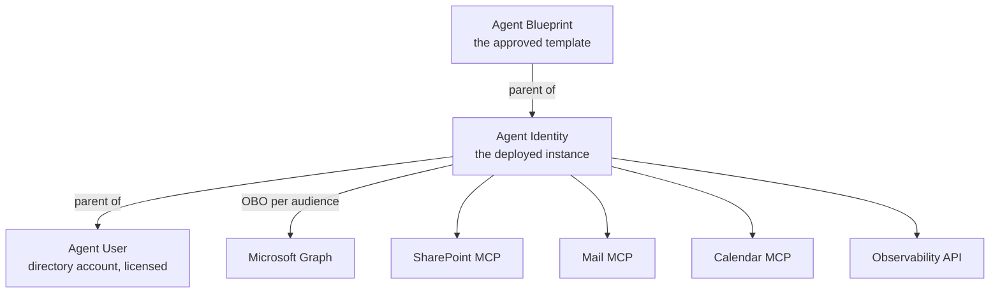
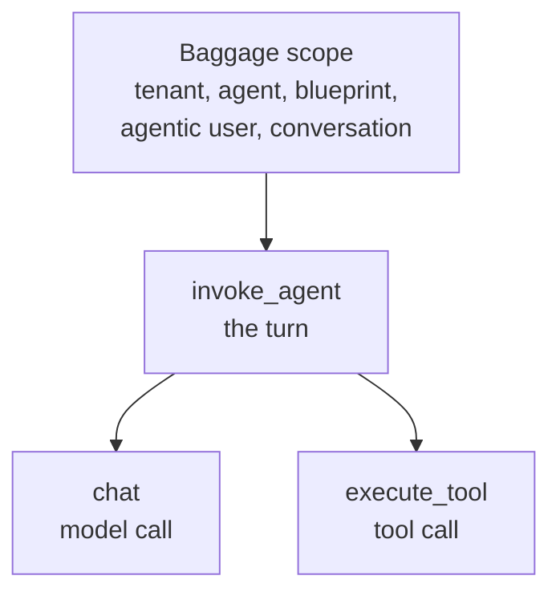
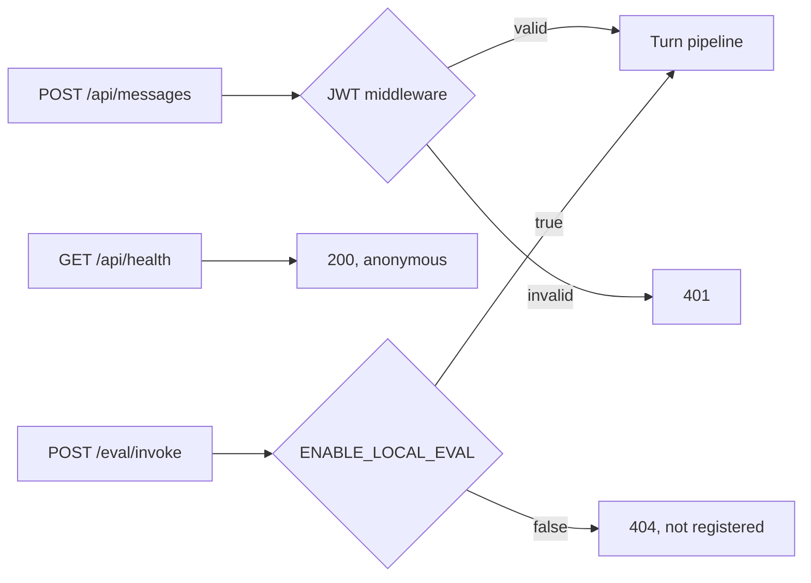
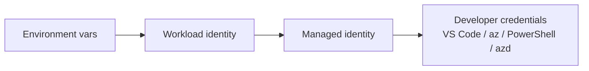

# Architecture

How LangchainOA is put together, and why each piece is there. Read this before
changing the turn pipeline or the identity plumbing.

---

## 1. Components

LangchainOA is an Agent 365 **AI Teammate**: it has its own directory identity
and is addressed like a colleague, rather than being an app a user launches.



Two things are deliberately separate:

- **Observability** answers *what did the agent do*. Always on in production.
- **Purview** answers *what content passed through*. Optional, and a different
  Graph API entirely.

---

## 2. Startup

Order matters in exactly one place: observability must be configured **before**
LangChain is imported, or the instrumentation cannot patch it.



`host.py` imports `run_agent` **inside** the handler, not at module scope, to
preserve that ordering.

---

## 3. One turn

Every token is minted per turn from the incoming activity. Nothing long-lived is
stored.



If Purview is disabled or unavailable, those steps are skipped and the turn
proceeds. Purview failures never break chat.

---

## 4. Identity

Three distinct objects. Confusing them is the most common cause of silent
failure.



Rules that are easy to get wrong:

- Runtime identity comes from the **activity**, never from config. `host.py`
  reads `recipient.agenticAppId` / `get_agentic_instance_id()`.
- Work IQ V2 servers each have a **different OAuth audience**. One token cannot
  be reused across SharePoint, Mail, and Calendar.
- Purview policies must be scoped to the **Agent Identity**, not the Blueprint.
- The Blueprint ID belongs in `microsoft.a365.agent.blueprint.id`. It must not
  become the runtime `gen_ai.agent.id`.

---

## 5. Telemetry

The Distro's LangChain instrumentation emits the spans Agent 365 expects. This
agent adds identity through baggage rather than creating its own root span.



The exporter drops any span that is missing tenant or agent identity, or whose
`gen_ai.operation.name` is not one of `invoke_agent`, `chat`, `execute_tool`,
`output_messages`, `apply_guardrail`.

Two deliberate choices:

- **No manual `InvokeAgentScope`.** LangChain already emits `invoke_agent`.
  Adding one produced two roots per turn and double-counted sessions.
- **OpenAI instrumentation disabled.** Its wrapper indexes
  `gen_ai.request.model`, which `AzureChatOpenAI` does not set, raising
  `KeyError` before the model was ever called. LangChain still emits the `chat`
  span, so nothing is lost.

---

## 6. Routes and authentication



| Route | Auth | Notes |
|---|---|---|
| `POST /api/messages` | Bot Framework JWT | Production entry point |
| `GET /api/health` | Anonymous | Liveness and feature flags |
| `POST /eval/invoke` | None | Local only. Never enable in production |

If the Blueprint credentials are incomplete the host logs a warning and runs
without JWT middleware — intended for local development only. In production,
confirm an unauthenticated `POST /api/messages` returns `401`.

---

## 7. Credentials

Every Azure call in this agent is keyless. There is no API key for the model and
no connection string for the tools — only Entra tokens plus RBAC.

The sample uses `DefaultAzureCredential` for both the model and the Azure tools:

```python
azure_ad_token_provider=get_bearer_token_provider(
    DefaultAzureCredential(),
    "https://cognitiveservices.azure.com/.default",
)
```

It tries a chain of sources and uses the first that works:



Exact developer credentials depend on the installed Azure Identity version.
Interactive browser authentication is not part of the default chain unless it
is explicitly enabled.

That is why the same code runs locally under `az login` and in Container Apps
under the managed identity, with no branching. For a sample, that is the point.

### Where it bites in production

| Risk | Consequence |
|---|---|
| More than one identity on the host | It may select the wrong one |
| Probing failed sources | Slower startup, notably IMDS |
| Succeeds as your developer account locally | Hides a missing role assignment until production |

### Alternatives

| Credential | Use for |
|---|---|
| `ManagedIdentityCredential(client_id=...)` | Production in Azure. Explicit and fastest |
| `WorkloadIdentityCredential` | AKS federated identity |
| `ChainedTokenCredential(...)` | Deterministic local plus cloud |
| `AzureCliCredential` | Local development only |
| `ClientSecretCredential` / `CertificateCredential` | An app registration acting as itself |
| `EnvironmentCredential` | CI and CD |

You can also keep `DefaultAzureCredential` and simply remove the ambiguity:

```python
DefaultAzureCredential(
    managed_identity_client_id=os.environ["UAMI_CLIENT_ID"],
    exclude_interactive_browser_credential=True,
    exclude_shared_token_cache_credential=True,
)
```

**Recommendation.** Keep the default for samples and development. In production,
pin the identity — either pass `managed_identity_client_id` or use
`ManagedIdentityCredential` directly — so identity selection is never inferred.
This is the same principle behind preferring federated credentials over a client
secret for the Blueprint: explicit identity beats implicit.

Roles the chosen identity needs:

| Scope | Role |
|---|---|
| Azure OpenAI account | Cognitive Services OpenAI User |
| Subscription | Reader in the sample |
| Narrower production alternative | Reader on selected resource groups plus Log Analytics Reader on selected workspaces |

---

## 8. Why this shape

| Decision | Reason |
|---|---|
| Microsoft 365 Agents SDK for hosting | Activity Protocol, agentic auth, and channel plumbing are provided |
| LangChain for orchestration | Swappable; the Agent 365 layer does not depend on it |
| Keyless Azure OpenAI | No API key to store or rotate |
| Read-only tools | Safe to demo against real tenant data |
| Baggage over manual scopes | One root span per turn, richer attributes, less code |
| Purview off by default | It needs tenant policy work; the agent must run without it |
