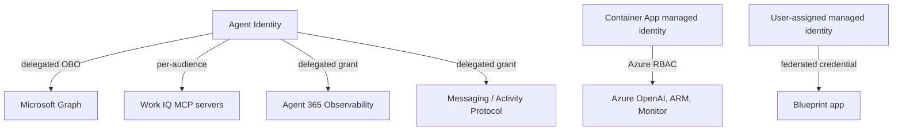

# Capabilities and permissions

What this agent can do, exactly which permissions make that possible, and where
to inspect or change them.

---

## What this agent is

LangchainOA is a Microsoft Agent 365 **AI Teammate**. It has its own directory
identity and licence, appears in Microsoft 365 like a colleague, and is
addressed by mentioning it rather than by launching an app.

It is a **read-only operations and knowledge assistant**. It can find and
summarise governed Microsoft 365 content, and report on Azure resources and
monitoring data. It ships with no model tool that sends mail, changes a
calendar, edits a document, or modifies an Azure resource. Opt-in email triage
adds approval-gated mail operations that run as application code.

Three properties are deliberate:

- **Read-only by construction.** Write capability is absent from the tool set,
  not merely discouraged in the prompt.
- **Governed data access.** Microsoft 365 content is reached through Work IQ
  MCP, so tenant policy and auditing apply.
- **Observable and governable.** Every turn emits Agent 365 telemetry, and
  content can optionally be evaluated by Microsoft Purview.

---

## Tools

| Tool | Does |
|---|---|
| `search_sharepoint` | Search SharePoint documents and folders |
| `list_workiq_tools` | List the read-only tools a Work IQ server offers |
| `call_readonly_workiq_tool` | Call one discovered read-only Work IQ tool |
| `list_resource_groups` | List Azure resource groups |
| `list_resources` | List resources, optionally filtered |
| `get_resource` | Read one resource's details |
| `query_metrics` | Query Azure Monitor metrics |
| `query_logs` | Run a bounded Log Analytics KQL query |

Work IQ tool catalogues change over time, so the agent discovers tools at
runtime rather than hard-coding names. Discovered tools are filtered by a
read-only policy before the model may call them. The name is split into words,
server prefixes such as `mcp_MailTools_graph_mail_` are removed, and then:

- the first word must be a read verb: `get`, `list`, `find`, `read`, `search`,
  `query`, or `browse`;
- no word may be a write verb, such as `send`, `reply`, `update`, `delete`,
  `move`, `mark`, `flag`, `check`, or `set` (the full list is `_WRITE_WORDS` in
  `tools/workiq_tools.py`);
- a tool whose MCP annotations say `readOnlyHint: false` or
  `destructiveHint: true` is rejected;
- when `WORKIQ_ALLOWED_TOOLS` is set, only those exact names are allowed.

A tool such as `sendMail` is rejected by that filter even if the tenant exposes
it and the model asks for it. `getMailboxSettings` is allowed, because `settings`
is not the word `set`.

### Email triage operations (opt-in)

With `ENABLE_EMAIL_TRIAGE=true`, `email_triage.py` runs fixed mail operations.
They are application code, not model tools, and the model call that classifies
email has no tools at all.

| Operation | Path (Work IQ Mail tool) | When it runs |
|---|---|---|
| Tag the message with `Triage/<category>` and `Triage/<priority>` | `UpdateMessage` | Automatically, if `EMAIL_TRIAGE_AUTO_TAG=true` |
| Reply in the original thread | **Agent 365 email channel** (no Work IQ call); `ReplyToMessage` only if the channel fails | After an approver sends `approve` or `edit` in Teams |
| Escalate to the account owner or `EMAIL_TRIAGE_ESCALATION_ADDRESS` | `SendEmailWithAttachments`; last resort `CreateDraftMessage` then `SendDraftMessage`, deleting the draft (`DeleteMessage`) if the send fails | After an approver sends `approve` in Teams |

Tools are resolved from the live Mail catalog by name, and arguments are built
from each tool's published input schema. If a required input can't be
supplied, the operation stops before calling the tool. Each tool's input
property names are logged once (never values).

Only the Entra object IDs in `EMAIL_TRIAGE_APPROVERS` can approve. Codes are
single-use and expire after `EMAIL_TRIAGE_APPROVAL_TTL_HOURS`.

---

## Permission planes

Permissions come from four independent places. A gap in any one produces a
different failure.



### 1. Microsoft Graph — delegated, via the Agent Identity

`a365 setup all` grants a broad default Graph set. LangchainOA itself calls
Microsoft Graph directly only for the optional Purview flow; SharePoint, Mail,
and Calendar content goes through Work IQ, not through these Graph scopes.

| Scope | Status in this sample |
|---|---|
| `User.Read.All`, `Sites.Read.All` | Granted by the default template; application code does not call them |
| `Chat.ReadWrite`, `ChannelMessage.Read.All`, `ChannelMessage.Send` | Granted by the default template; Activity Protocol messaging uses the Agent Data permission instead |
| `Mail.ReadWrite`, `Mail.Send` | Granted by the default template; used through Work IQ Mail only when email triage is enabled |
| `Files.ReadWrite.All` | Granted by the default template; application code does not call it |
| `Content.Process.User`, `ProtectionScopes.Compute.User`, `ContentActivity.Write` | Used by `purview.py` when Purview is enabled |

> **Least privilege.** The default template grants write scopes — `Mail.Send`,
> `Mail.ReadWrite`, `Files.ReadWrite.All` — that the read-only baseline never
> uses. The model cannot write, but the *identity* is permitted to. Trim them
> for anything beyond a demo. Keep `Mail.ReadWrite` and `Mail.Send` if email
> triage is enabled. See below for how.

### 2. Work IQ MCP — one audience per server

Each V2 server is a separate OAuth audience. A token minted for one is rejected
by the others, so the agent exchanges one token per server, per turn.

| Server | Scope |
|---|---|
| `mcp_SharePointRemoteServer` | `Tools.ListInvoke.All` |
| `mcp_MailTools` | `Tools.ListInvoke.All` |
| `mcp_CalendarTools` | `Tools.ListInvoke.All` |

`ToolingManifest.json` is the preferred runtime source. The code also carries
Microsoft's current server metadata as a fallback for local/bootstrap use.
Regenerate the manifest per tenant rather than relying on that fallback.

### 3. Agent 365 platform

| Permission | Needed for |
|---|---|
| `Agent365.Observability.OtelWrite` | Export spans |
| `McpServersMetadata.Read.All` | Discover Work IQ servers |
| `AgentData.ReadWrite` | Activity Protocol replies |
| `Connectivity.Connections.Read` | Power Platform connectivity |

### 4. Azure RBAC — the Container App's managed identity

Separate from Entra permissions. Assigned by `infra/deploy-azure.sh`.

| Scope | Role |
|---|---|
| Azure OpenAI account | Cognitive Services OpenAI User |
| Subscription | Reader in the sample, so ARM, metrics, and logs can be inspected |
| Narrower production alternative | Reader on selected resource groups plus Log Analytics Reader on selected workspaces |

The app also carries a user-assigned managed identity, added by
`infra/enable-federated-credentials.sh`. It has **no** Azure roles. Its only use
is as the Blueprint's federated credential, so the app can prove it is the
Blueprint without a secret. Check it with:

```bash
az ad app federated-credential list --id <BLUEPRINT_APP_ID> -o table
az ad app credential list --id <BLUEPRINT_APP_ID>   # expect [] once the secret is deleted
```

---

## Where to look

**Microsoft 365 admin centre** — the agent, its owner, and licence:
`Agents → your agent`

**Entra admin centre** — identity and consent:

- `Applications → App registrations` → your Blueprint → **API permissions**
- `Applications → Enterprise applications` → the Agent Identity → **Permissions**
- `Identity → Users` → the agent user, shown with *Is Agent = Yes*

**Azure portal** — RBAC: the Container App's **Identity** blade, then
**Azure role assignments**.

**Command line** — what is actually granted to the Agent Identity:

```bash
az rest --method GET \
  --url "https://graph.microsoft.com/v1.0/oauth2PermissionGrants?\$filter=clientId eq '<AGENT_IDENTITY_SERVICE_PRINCIPAL_OBJECT_ID>'" \
  --query 'value[].{resourceId:resourceId,scope:scope}' -o json
```

Azure roles held by the app's managed identity:

```bash
az role assignment list --assignee-object-id <PRINCIPAL_ID> \
  --all --query '[].{role:roleDefinitionName,scope:scope}' -o table
```

Runtime is the most reliable source. The logs show each exchange as it happens:

```text
Retrieving agentic user token for scopes: [...]
```

---

## Where to add or change

| Change | How |
|---|---|
| Work IQ servers | `a365 develop add-mcp-servers`, then `a365 setup permissions mcp` |
| Graph scopes | Add to the Blueprint's API permissions and consent, then to the Agent Identity grant |
| Observability | `a365 setup permissions bot`, or add `Agent365.Observability.OtelWrite` on the Blueprint |
| Azure roles | `az role assignment create` against the app's managed identity |
| Remove a capability | Delete the tool. The prompt alone is not a control |

Adding a scope is two steps, and missing the second is a common failure: the
Blueprint must permit it (inheritable permissions), **and** the grant must exist
on the identity that requests the token.

Before trimming, inspect both the application's direct calls and the
`AGENTIC` handler's configured scopes, then test Teams, Work IQ, observability,
and Purview end to end. Re-running `a365 setup all` can reapply the default
template, so re-audit after any CLI re-run.

---

## Adding a capability safely

1. Add the tool, keeping the read-only naming convention so the filter accepts it
2. Grant only the scope that tool requires
3. State the capability in `agent-prompt.txt` so the model knows it exists
4. Confirm the token exchange succeeds in the logs
5. If the tool returns content, confirm Purview still evaluates the turn

If a capability must write, treat it as a different agent shape: add explicit
confirmation, put the write behind a separate approval step, and re-check the
Purview and observability story before enabling it.
