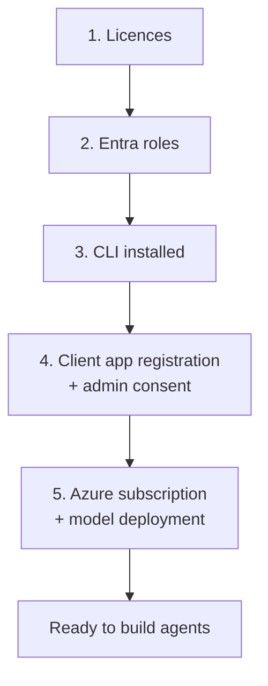

# Prerequisites and tenant onboarding

What must exist in a tenant before this agent — or any Agent 365 agent — can be
built and deployed. Written for a tenant that has not run Agent 365 before.

Official references:
[Agent 365 CLI](https://learn.microsoft.com/microsoft-agent-365/developer/agent-365-cli) ·
[Custom client app registration](https://learn.microsoft.com/microsoft-agent-365/developer/custom-client-app-registration) ·
[Quickstart: Connect an existing agent](https://learn.microsoft.com/microsoft-agent-365/developer/get-started) ·
[Publish agent](https://learn.microsoft.com/microsoft-agent-365/developer/publish) ·
[Create agent instance](https://learn.microsoft.com/microsoft-agent-365/developer/create-instance) ·
[Microsoft OpenTelemetry Distro](https://learn.microsoft.com/microsoft-agent-365/developer/microsoft-opentelemetry)

---

## The five things a tenant needs



Steps 1, 2, and 4 are one-time tenant work and usually need an administrator.
Steps 3 and 5 are per developer. Step 6, Microsoft Purview, is optional and only
needed if you want prompt and response content captured.

---

## 1. Licences

Agent 365 licences are assigned to **agent users**, not to people. Productivity
licences such as Microsoft 365 E5 stay with humans.

| Need | Why |
|---|---|
| An Agent 365 licence per agent instance | Instance creation fails without one |
| Microsoft 365 Copilot | Required for Work IQ (SharePoint, Mail, Calendar) |

Check what the tenant actually has, and how many are already consumed:

```bash
az rest --method GET \
  --url 'https://graph.microsoft.com/v1.0/subscribedSkus?$select=skuPartNumber,prepaidUnits,consumedUnits' \
  --query "value[?contains(skuPartNumber,'AGENT')].{sku:skuPartNumber,enabled:prepaidUnits.enabled,consumed:consumedUnits}" \
  -o table
```

If every licence is consumed, instance creation fails — often with an unhelpful
error. Check consumption before blaming configuration.

---

## 2. Entra roles

| Role | Can do |
|---|---|
| **Global Administrator** | Tenant-wide administration and consent; do not assume it replaces Agent Registry Administrator for registration workflows |
| **Agent ID Administrator** | Manage blueprints and agent identities |
| **Agent ID Developer** | Create and deploy agents |
| **Agent Registry Administrator** | Register agent instances |

For consenting to the CLI app specifically, **Application Administrator** or
**Cloud Application Administrator** is enough — Global Administrator is not
required.

A developer without admin rights can still work: they complete the app
registration, then hand the **Application (client) ID** to an administrator for
the consent step.

---

## 3. Install the CLI

Requires **.NET 8.0 or later**.

```bash
dotnet tool install --global Microsoft.Agents.A365.DevTools.Cli
a365 -h
```

| Task | Command |
|---|---|
| Update | `dotnet tool update --global Microsoft.Agents.A365.DevTools.Cli` |
| Uninstall | `dotnet tool uninstall --global Microsoft.Agents.A365.DevTools.Cli` |

Installed to `$HOME/.dotnet/tools` on macOS and Linux,
`%USERPROFILE%\.dotnet\tools` on Windows. Tools are per user, not machine-wide.

> Pin the CLI version in team documentation. Behaviour changes between versions —
> commands have appeared and disappeared across releases — so "it works on my
> machine" is frequently a version difference.

---

## 4. Client app registration

The CLI authenticates **as you** and acts on your behalf, so it needs its own
app registration with **delegated** permissions.

### Fast path

A Global Administrator can let the CLI do all of it:

```bash
a365 setup requirements
```

If the `Agent 365 CLI` app does not exist, type `C` and the CLI creates it and
grants consent in one step.

### Manual path

1. **Register** — Microsoft Entra admin centre → App registrations → New
   registration
   - Name it exactly **`Agent 365 CLI`** to enable the config-free
     `a365 setup all --agent-name` flow; the CLI resolves it by display name
   - **Single tenant**
   - Redirect URI: **Public client/native**, `http://localhost:8400/`
2. **Redirect URIs** — three are needed in total. `a365 setup requirements` adds
   any that are missing:

   | URI | For |
   |---|---|
   | `http://localhost:8400/` | MSAL interactive browser sign-in |
   | `http://localhost` | Graph PowerShell `Connect-MgGraph` |
   | `ms-appx-web://Microsoft.AAD.BrokerPlugin/{client-id}` | Web Account Manager |

3. **Permissions** — seven, all **Delegated**, never Application:

   | Permission | Purpose |
   |---|---|
   | `AgentIdentityBlueprint.ReadWrite.All` | Blueprint lifecycle (beta) |
   | `AgentIdentityBlueprintPrincipal.Create` | Blueprint service principal (beta) |
   | `AgentIdentity.Read.All` | Identity lookup (beta) |
   | `AgentIdentity.DeleteRestore.All` | Cleanup (beta) |
   | `AgentRegistration.ReadWrite.All` | Agent registrations |
   | `Application.Read.All` | Service principal lookup by app ID |
   | `User.Read` | Signed-in user, for owner and sponsor |

   Then **Grant admin consent** and confirm every row shows a green check.

4. **`wids` optional claim** — Token configuration → Add optional claim →
   **Access** → `wids`.

   Without it the CLI cannot read your directory roles from the token and falls
   back to printing PowerShell instructions for every admin step, even when you
   are an admin. Note `wids` reflects only *directly assigned* roles, not roles
   inherited through groups.

### If the beta permissions are not visible

`AgentIdentityBlueprint.*` and `AgentIdentity.*` are beta APIs and may not
appear in the portal. Grant them through Graph Explorer instead:

```http
POST https://graph.microsoft.com/v1.0/oauth2PermissionGrants
```

```json
{
  "clientId": "<SP_OBJECT_ID>",
  "consentType": "AllPrincipals",
  "principalId": null,
  "resourceId": "<GRAPH_RESOURCE_ID>",
  "scope": "AgentIdentityBlueprint.ReadWrite.All AgentIdentityBlueprintPrincipal.Create AgentIdentity.Read.All AgentIdentity.DeleteRestore.All AgentRegistration.ReadWrite.All Application.Read.All User.Read"
}
```

> **Do not click "Grant admin consent" in the portal afterwards.** The portal
> cannot see beta permissions and will overwrite the grant with only the visible
> ones — silently removing the beta permissions you just added. `AllPrincipals`
> already *is* tenant-wide consent.

If you get `Request_MultipleObjectsWithSameKeyValue`, a grant already exists —
`PATCH` it with the full scope string instead of creating a new one.

---

## 5. Azure

### What you need before deploying

| Requirement | Notes |
|---|---|
| Subscription | Same tenant as the licences avoids cross-tenant friction |
| Azure OpenAI resource with a chat deployment | This sample uses the direct Azure OpenAI endpoint; Foundry project endpoints require the `langchain-azure-ai` integration |
| Model quota | The deployment needs enough TPM to serve turns. A new resource may start at a low default |
| Region for the app | Container Apps must be available there |
| Region for the registry | Needs **ACR Tasks** for server-side builds. It does not have to match the app's region |
| Resource providers registered | `Microsoft.App`, `Microsoft.OperationalInsights`, `Microsoft.ContainerRegistry` |

### Permissions to run the deployment

Two different things, and the second is the one people miss:

| To do | You need |
|---|---|
| Create the resource group, registry, workspace, environment, and app | **Contributor** on the subscription or target resource group |
| Assign roles to the app's managed identity | **Owner**, **User Access Administrator**, or **Role Based Access Control Administrator** |
| Switch to federated credentials (`enable-federated-credentials.sh`) | **Contributor** on the resource group, and ownership of the Blueprint app (the `a365 setup` account) or **Agent ID Administrator** in Entra |

`Contributor` alone cannot create role assignments. Without one of the second
set, the script provisions everything and then fails at `az role assignment
create` — leaving an app that cannot reach the model.

You also need **Cognitive Services OpenAI User** on the model account for
yourself, so you can run the agent locally with `az login`.

### What the deployment creates

`infra/deploy-azure.sh` provisions one isolated set per agent:

| Resource | Configuration |
|---|---|
| Resource group | `rg-agent365-<agent>-<location>` |
| Container registry | Basic SKU, admin user disabled — image pull uses managed identity |
| Log Analytics workspace | Backs the Container Apps environment and holds console logs |
| Container Apps environment | One per agent in this sample |
| Container app | 1.0 vCPU, 2 GiB, min and max 1 replica, external ingress on port 8080, system-assigned identity |
| User-assigned managed identity | `id-<app>`, created by `enable-federated-credentials.sh`; no Azure roles, Blueprint federated credential only |

It then assigns the app's managed identity:

| Role | Scope |
|---|---|
| Cognitive Services OpenAI User | The Azure OpenAI account |
| Reader | The subscription, so the Azure tools can inspect it |

Everything is idempotent, so re-running it ships a new build rather than
duplicating resources.

### Cost and cleanup

The app is pinned to a single always-on replica, so it bills continuously rather
than scaling to zero. Registry and Log Analytics add a small amount; the model is
billed per token. Set `--min-replicas 0` if you would rather trade cold starts
for lower cost in a demo environment.

Remove everything with:

```bash
az group delete --name rg-agent365-<agent>-<location>
```

The Azure OpenAI resource is **not** created by the script, so it survives that
delete and can be shared across several agents.

---

## 6. Microsoft Purview (only for content capture)

Skip this unless you want prompt and response **content** captured or blocked.
The agent runs fine without it, and it is disabled by default.

Observability and Purview answer different questions. Observability records that
the agent ran and what it called. Only Purview records what was actually said.

| Requirement | Notes |
|---|---|
| Auditing enabled for the organisation | Required before captured content appears in Purview |
| Licensing that covers DSPM for AI | Confirm against your tenant's Purview entitlements |
| An admin who can manage Purview policies | Needed to run `Connect-IPPSSession` and create the collection policy — for example Compliance Administrator |
| **Content Explorer Content Viewer** | Needed to *read* captured text; without it rows appear with no content |
| Exchange Online mailbox on the agent user | Content renders blank without one |
| Three delegated Graph scopes | `Content.Process.User`, `ProtectionScopes.Compute.User`, `ContentActivity.Write` — see [Deploy in your tenant](deploy-in-your-tenant.md) step 6 |

Two things that decide whether it works at all:

- The DSPM collection policy must have **ingestion enabled**, or you get policy
  matches with no text.
- It must be scoped to the identity the **runtime reports**, not the Blueprint.
  Take that GUID from the log, not from config.

Also check whether a tenant-wide capture policy already covers your agent before
creating a per-agent one.

---

## Verify before building

```bash
a365 setup requirements     # validates app registration and permissions
az account show             # correct subscription and tenant
a365 -h                     # CLI resolves
```

Azure side:

```bash
# Can you assign roles, not just create resources?
az role assignment list --assignee $(az ad signed-in-user show --query id -o tsv) \
  --scope /subscriptions/$(az account show --query id -o tsv) \
  --query '[].roleDefinitionName' -o tsv

# Providers registered
az provider show -n Microsoft.App --query registrationState -o tsv
az provider show -n Microsoft.OperationalInsights --query registrationState -o tsv
az provider show -n Microsoft.ContainerRegistry --query registrationState -o tsv

# Model deployment exists
az cognitiveservices account deployment list \
  -n <aoai-name> -g <aoai-rg> --query '[].name' -o tsv
```

Checklist:

- [ ] Agent 365 licences available, not fully consumed
- [ ] Your account holds a role that can create agents
- [ ] `Agent 365 CLI` app exists with all seven delegated permissions consented
- [ ] `wids` claim added
- [ ] Azure subscription selected and model deployed
- [ ] You can create **role assignments**, not only resources
- [ ] Resource providers registered
- [ ] Chosen registry region supports ACR Tasks

---

## Common onboarding failures

| Symptom | Cause |
|---|---|
| `AADSTS82001` | Client app missing permissions or admin consent |
| Beta permissions vanish after portal consent | Portal overwrote the Graph-granted scope |
| CLI prints PowerShell instructions though you are admin | `wids` claim missing |
| `403` on OAuth2 grant operations | `http://localhost` redirect URI missing |
| Instance creation fails silently | No Agent 365 licence available |
| Work IQ returns nothing | Missing Copilot licence, or servers not added |
| CLI command does not exist | Version drift — check `a365 --version` |
| Deploy creates resources then fails on `az role assignment create` | You have Contributor but not Owner, User Access Administrator, or RBAC Administrator |
| `az acr build` fails with `NoRegisteredProviderFound` | The registry region does not offer ACR Tasks — set `ACR_LOCATION` to one that does |
| `MissingSubscriptionRegistration` | Register `Microsoft.App`, `Microsoft.OperationalInsights`, or `Microsoft.ContainerRegistry` |
| Agent deploys but model calls fail with 401 or 403 | The app's managed identity lacks **Cognitive Services OpenAI User** on the model account |
| Model calls fail with 429 | Deployment TPM quota is too low for the traffic |

Anything beyond onboarding is in [Troubleshooting](troubleshooting.md).

---

## Then deploy

With the tenant onboarded, continue with
[Deploy in your tenant](deploy-in-your-tenant.md).
