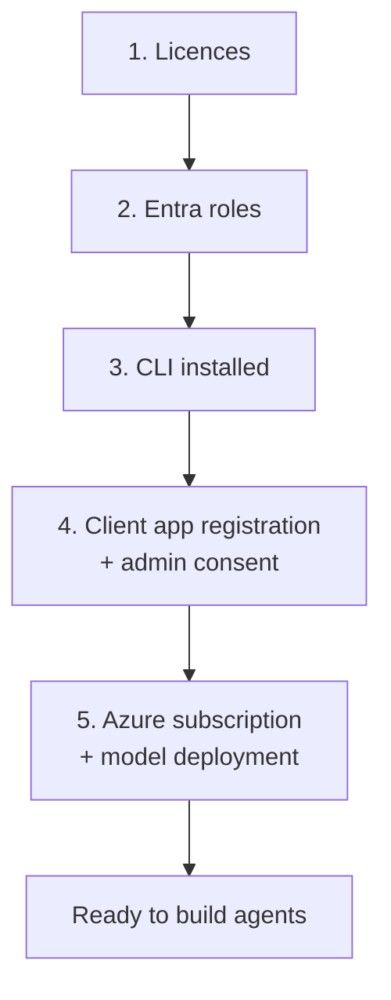

# Prerequisites and tenant onboarding

What must exist in a tenant before this agent — or any Agent 365 agent — can be
built and deployed. Written for a tenant that has not run Agent 365 before.

Official references:
[Agent 365 CLI](https://learn.microsoft.com/microsoft-agent-365/developer/agent-365-cli) ·
[Custom client app registration](https://learn.microsoft.com/microsoft-agent-365/developer/custom-client-app-registration) ·
[Quickstart: Connect an existing agent](https://learn.microsoft.com/microsoft-agent-365/developer/get-started) ·
[Publish agent](https://learn.microsoft.com/microsoft-agent-365/developer/publish) ·
[Create agent instance](https://learn.microsoft.com/microsoft-agent-365/developer/create-instance) ·
[Microsoft OpenTelemetry Distro](https://learn.microsoft.com/microsoft-agent-365/developer/microsoft-opentelemetry)

---

## The five things a tenant needs



Steps 1, 2, and 4 are one-time tenant work and usually need an administrator.
Steps 3 and 5 are per developer.

---

## 1. Licences

Agent 365 licences are assigned to **agent users**, not to people. Productivity
licences such as Microsoft 365 E5 stay with humans.

| Need | Why |
|---|---|
| An Agent 365 licence per agent instance | Instance creation fails without one |
| Microsoft 365 Copilot | Required for Work IQ (SharePoint, Mail, Calendar) |

Check what the tenant actually has, and how many are already consumed:

```bash
az rest --method GET \
  --url 'https://graph.microsoft.com/v1.0/subscribedSkus?$select=skuPartNumber,prepaidUnits,consumedUnits' \
  --query "value[?contains(skuPartNumber,'AGENT')].{sku:skuPartNumber,enabled:prepaidUnits.enabled,consumed:consumedUnits}" \
  -o table
```

If every licence is consumed, instance creation fails — often with an unhelpful
error. Check consumption before blaming configuration.

---

## 2. Entra roles

| Role | Can do |
|---|---|
| **Global Administrator** | Tenant-wide administration and consent; do not assume it replaces Agent Registry Administrator for registration workflows |
| **Agent ID Administrator** | Manage blueprints and agent identities |
| **Agent ID Developer** | Create and deploy agents |
| **Agent Registry Administrator** | Register agent instances |

For consenting to the CLI app specifically, **Application Administrator** or
**Cloud Application Administrator** is enough — Global Administrator is not
required.

A developer without admin rights can still work: they complete the app
registration, then hand the **Application (client) ID** to an administrator for
the consent step.

---

## 3. Install the CLI

Requires **.NET 8.0 or later**.

```bash
dotnet tool install --global Microsoft.Agents.A365.DevTools.Cli
a365 -h
```

| Task | Command |
|---|---|
| Update | `dotnet tool update --global Microsoft.Agents.A365.DevTools.Cli` |
| Uninstall | `dotnet tool uninstall --global Microsoft.Agents.A365.DevTools.Cli` |

Installed to `$HOME/.dotnet/tools` on macOS and Linux,
`%USERPROFILE%\.dotnet\tools` on Windows. Tools are per user, not machine-wide.

> Pin the CLI version in team documentation. Behaviour changes between versions —
> commands have appeared and disappeared across releases — so "it works on my
> machine" is frequently a version difference.

---

## 4. Client app registration

The CLI authenticates **as you** and acts on your behalf, so it needs its own
app registration with **delegated** permissions.

### Fast path

A Global Administrator can let the CLI do all of it:

```bash
a365 setup requirements
```

If the `Agent 365 CLI` app does not exist, type `C` and the CLI creates it and
grants consent in one step.

### Manual path

1. **Register** — Microsoft Entra admin centre → App registrations → New
   registration
   - Name it exactly **`Agent 365 CLI`** to enable the config-free
     `a365 setup all --agent-name` flow; the CLI resolves it by display name
   - **Single tenant**
   - Redirect URI: **Public client/native**, `http://localhost:8400/`
2. **Redirect URIs** — three are needed in total. `a365 setup requirements` adds
   any that are missing:

   | URI | For |
   |---|---|
   | `http://localhost:8400/` | MSAL interactive browser sign-in |
   | `http://localhost` | Graph PowerShell `Connect-MgGraph` |
   | `ms-appx-web://Microsoft.AAD.BrokerPlugin/{client-id}` | Web Account Manager |

3. **Permissions** — seven, all **Delegated**, never Application:

   | Permission | Purpose |
   |---|---|
   | `AgentIdentityBlueprint.ReadWrite.All` | Blueprint lifecycle (beta) |
   | `AgentIdentityBlueprintPrincipal.Create` | Blueprint service principal (beta) |
   | `AgentIdentity.Read.All` | Identity lookup (beta) |
   | `AgentIdentity.DeleteRestore.All` | Cleanup (beta) |
   | `AgentRegistration.ReadWrite.All` | Agent registrations |
   | `Application.Read.All` | Service principal lookup by app ID |
   | `User.Read` | Signed-in user, for owner and sponsor |

   Then **Grant admin consent** and confirm every row shows a green check.

4. **`wids` optional claim** — Token configuration → Add optional claim →
   **Access** → `wids`.

   Without it the CLI cannot read your directory roles from the token and falls
   back to printing PowerShell instructions for every admin step, even when you
   are an admin. Note `wids` reflects only *directly assigned* roles, not roles
   inherited through groups.

### If the beta permissions are not visible

`AgentIdentityBlueprint.*` and `AgentIdentity.*` are beta APIs and may not
appear in the portal. Grant them through Graph Explorer instead:

```http
POST https://graph.microsoft.com/v1.0/oauth2PermissionGrants
```

```json
{
  "clientId": "<SP_OBJECT_ID>",
  "consentType": "AllPrincipals",
  "principalId": null,
  "resourceId": "<GRAPH_RESOURCE_ID>",
  "scope": "AgentIdentityBlueprint.ReadWrite.All AgentIdentityBlueprintPrincipal.Create AgentIdentity.Read.All AgentIdentity.DeleteRestore.All AgentRegistration.ReadWrite.All Application.Read.All User.Read"
}
```

> **Do not click "Grant admin consent" in the portal afterwards.** The portal
> cannot see beta permissions and will overwrite the grant with only the visible
> ones — silently removing the beta permissions you just added. `AllPrincipals`
> already *is* tenant-wide consent.

If you get `Request_MultipleObjectsWithSameKeyValue`, a grant already exists —
`PATCH` it with the full scope string instead of creating a new one.

---

## 5. Azure

| Requirement | Notes |
|---|---|
| Subscription | Same tenant as the licences avoids cross-tenant friction |
| Azure OpenAI resource with a chat deployment | This sample uses the direct Azure OpenAI endpoint; Foundry project endpoints require the `langchain-azure-ai` integration |
| **Cognitive Services OpenAI User** | For you locally and for the app's managed identity |
| Region with ACR Tasks | Needed for server-side image builds; may differ from the app's region |

---

## Verify before building

```bash
a365 setup requirements     # validates app registration and permissions
az account show             # correct subscription and tenant
a365 -h                     # CLI resolves
```

Checklist:

- [ ] Agent 365 licences available, not fully consumed
- [ ] Your account holds a role that can create agents
- [ ] `Agent 365 CLI` app exists with all seven delegated permissions consented
- [ ] `wids` claim added
- [ ] Azure subscription selected, model deployed, roles assigned

---

## Common onboarding failures

| Symptom | Cause |
|---|---|
| `AADSTS82001` | Client app missing permissions or admin consent |
| Beta permissions vanish after portal consent | Portal overwrote the Graph-granted scope |
| CLI prints PowerShell instructions though you are admin | `wids` claim missing |
| `403` on OAuth2 grant operations | `http://localhost` redirect URI missing |
| Instance creation fails silently | No Agent 365 licence available |
| Work IQ returns nothing | Missing Copilot licence, or servers not added |
| CLI command does not exist | Version drift — check `a365 --version` |

Anything beyond onboarding is in [Troubleshooting](troubleshooting.md).

---

## Then deploy

With the tenant onboarded, continue with
[Deploy in your tenant](deploy-in-your-tenant.md).
